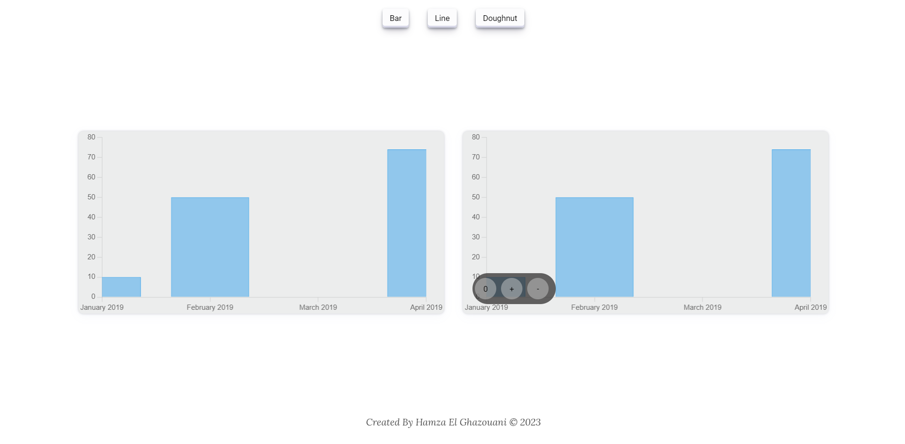
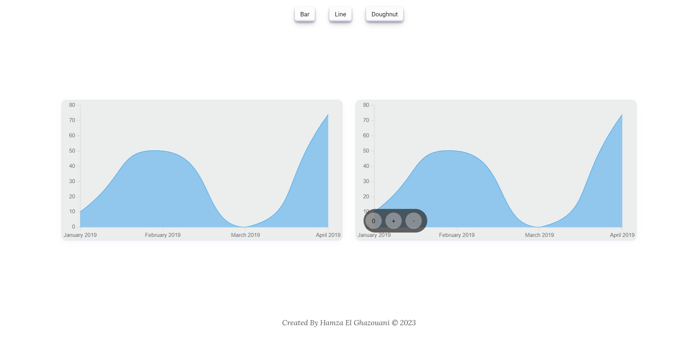
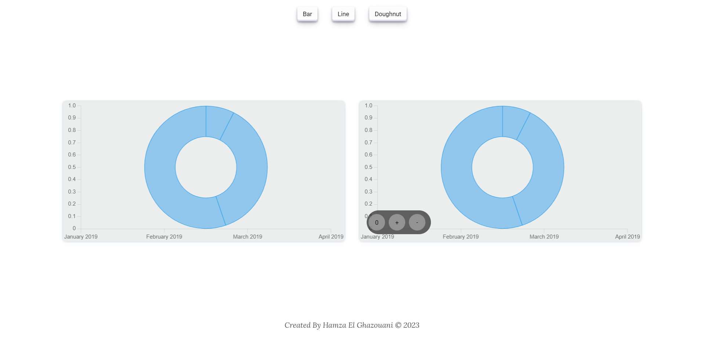

# Chart for Angular Project

>  *  This project was generated with [Angular CLI](https://github.com/angular/angular-cli) version 16.2.0.





## Development server

Run `npm strat` for a dev server. Navigate to `http://localhost:4200/`. The application will automatically reload if you change any of the source files.

## Angular Chart Components

Angular Chart Components is a set of ready-to-use components designed to simplify the integration of interactive charts into your Angular projects. These components are built on the popular Chart.js library, offering a robust solution for data visualization in your web applications.

### Table of Contents

1. [Prerequisites](#prerequisites)
2. [Installation](#installation)
3. [Usage](#usage)


## Prerequisites

Before you start integrating the chart components, make sure you have the following prerequisites in place:

- Node.js and npm installed
- An existing Angular project

## Installation

To integrate the chart components into your Angular project, follow these steps:

1. **Install Chart.js**:

   In your Angular project directory, run the following command to install 
   
   *Chart.js:*

   ```bash
    npm install chart.js
    ```

    *chartjs-plugin-zoom:*

   ```bash
    npm install chartjs-plugin-zoom
    ```
## usage

To use the Simple Chart component in your Angular project, follow these steps:

1. **Create a Chart Component:**

   Use the Angular CLI command to generate a chart component by running the following command:

   ```bash
   ng generate component chart
    ```

2. **Copy HTML, CSS, and TypeScript Code:**

    In the directory of your newly generated chart component (chart), replace the content of the HTML, CSS, and TypeScript files with the corresponding code found in the src/app/component/chart folder of your project.

3. **Integrate the Chart Component:**

    In the HTML file of your Angular component where you want to display the chart, add the <app-chart> tag as follows:
    
    ```html
    <app-chart [data]="data" [label]="label" [title]="'test'" [type]="type"></app-chart>
    ```
    Make sure to customize the data, label, title, and type attributes according to your specific chart data and requirements.

    **You can follow a similar format to document the usage of the Zoom Chart component, just replacing the component name and specific details accordingly.**

